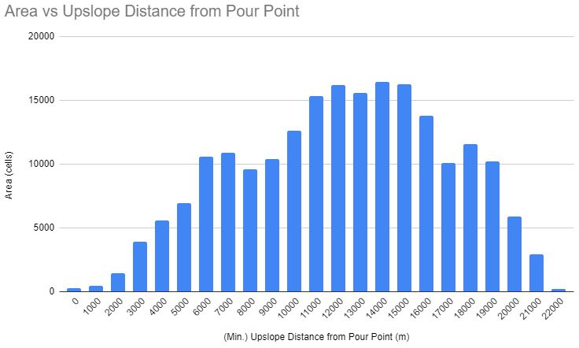
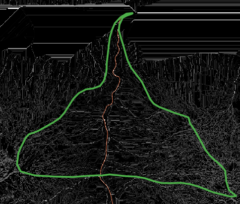

<section class="banner style1 orient-right fullscreen">

# Surface Runoff
## Methods in Spatial Analysis
## Assignment #5

Luke McQuade, January 2022

</section>

<section class="banner style1 orient-left content-align-left image-position-center onscroll-content-fade-in onscroll-image-fade-in fullscreen">

## Introduction
The [previous assignment][A_Terrain] covered some terrain analysis around the town of Mittersill, Salzburg, where the river Felber meets the Salzach.

Here, some basic hydrological analysis of the area is performed, using [QGIS][QGIS] and the integrated [SAGA][QGIS_SAGA] tools.

*If any of these hydrology terms are not familiar, the Stream Sense ['What Is A Catchment'][NZ_Guide] from Waikato Regional Council, New Zealand, seems to be a great guide.*

Per the [exercise guidance][Ex], the task is to create a rough flow model based on the upslope distance for the given pour point, i.e. rainfall at equal upslope distances reaches the outflow at the same time. Based on its distribution, an approximate unit hydrograph can be created.

## Method
The main steps involved in creating this type of flow model are:
1. Preprocess the DEM by sink-filling.
2. Generate a flow accumulation surface.
3. Create a channel network and basins.
4. Calculate a surface of the upslope distance from pour point.

A [hydrology QGIS tutorial][QGIS_Hydro] is available, which covers most of these steps. Please refer to this for details on steps 1 to 3. 

The [D8][D8] flow direction algorithm was used throughout.

### Calculating upslope distance from pour point
There doesn't seem to be a tool in QGIS explictly designed for this, but it can be achieved with an unconventional use of the [*Overland flow distance to channel network*][SAGA_OverlandFlow] operation. This expects a channel network raster layer to be fed into it. Instead, create a single pixel raster of the pour point, and use that in its place.

### Topo-flow Model
The QGIS ModelBuilder was used to develop a repeatable workflow for calculating the flow model, named 'Topo-flow'.

📷 *A screenshot of the model. The model is saved in the [QGIS project](#QGIS-project).*

### Further processing
Once the upslope distance surface had been created, which was continuous over the range 0 to ~22000m, it was binned by 1000m, and area zones were created from the binned surface. These zones correspond to the bins in the unit hydrograph.  

## Results
The calculated stream network, sub-basins and area zones within the catchment are shown on the map.

📷 *The histogram of the upslope distance from pour point, 1000m bins. In our model, this is the unit hydrograph for the catchment of the Felber.*

## Discussion
### Q: *What are the most critical zones in the catchment area, and how might land cover/use decisions influence the risk of floods?*

The peaks in the histogram represent the largest areas of similar distance, and hence contribution to flow. Deforestation leads to less absorption of rain by root systems, so clear-cutting in the areas would have the greatest adverse impact on flood risk. Similarly, soil-sealing inhibits natural drainage, so building on these areas is a further land use change that would negatively affect flood risk. The symbology was chosen accordingly: Green = low impact on flood risk, red = high impact on flood risk.  

### DEM selection
Salzburg has freely available digital terrain models (DTMs) of the entire state down to 1m resolution. Initially a DTM of 5m meters was chosen. However, this seemed to be *too* fine - the  tools model channels as single-cell-width (raster) and lines (vector), and in reality the streams in the study area were wider than this.  

  
📷*This resulted in multiple channels for the same feature, and a confusing stream network and results of subsequent calculations. You can also see the effects here of choosing a low  [channel initiation threshold](#channel-initiation-threshold).*

Resampling the DEM to 20m gave much better results.

### Study area
You will notice from the map the irregular shape of the study area. This is due to the DEM being for the state of Salzburg only, so the study area follows the state boundaries present in this relatively narrow part of the state. While state boundaries are often along ridges, that does not necessarily divide the watershed*. For a more accurate assessment, the DEM should be patched with data from the surrounding areas.

[][WA_PB]  
📷 **For example, see some of the [Argentina-Chile border disputes][ArgChile]. Credit: 'Southern Patagonian Ice Field border', by [Janitoalevic][WU_Janitoalevic], [CC-BY-SA-4.0][CC-BY-SA-4].*

### Channel initiation threshold
The channel initiation threshold is probably the most important parameter of the model. It is the value of flow accumulation at which a cell is designated a channel/stream,
and this determines the stream network and sub-basin structure. It is not a straight-forward parameter to 'guess' - it depends on the cell size, terrain, study area and use case.
You can see the resultant stream network and sub-basins for a variety of values on the map (1, 2 and 5 million), as well as 'ground-truth' state-provided survey layers for comparison. The area zones were calculated based on an initiation of 5M. Looking again at the survey layers for comparison, it seems a smaller threshold would have been more appropriate. 

### Pour point
The pour point is another important, sensitive parameter. Especially when using high resolution DEMs, when a slight change can result in empty or confusing result sets.  

Conceptually, the pour point would be at the confluence of the Felber and Salzach. But, here it is placed on the Felber slightly upstream of where they meet. The reason for this is that the upslope area would otherwise include the catchment of the Salzach also.  

  
📷 *Remember, this point is rasterized to a grid cell - keep in mind the cell size, and that it doesn't fall into the same cell as the actual confluence.*

### Q: *What are the effects if the 'Fill sinks' step is not performed?*
The fill sinks step guarantees there is a continuous, downslope path for every cell in an area. Without this, it would result in a patchy, disconnected stream network.
None of the subsequent calculations would then make sense.

### Q: *What are some of the limitations of this model?*
* Groundwater is not considered, but can be a major contributor to a catchment's stream network.
* Slope and land cover are not considered either. These are also major factors in downslope flow.
* The model assumes uniform rainfall over the entire catchment. The larger the catchment, the less reliable this is.
* The bin size of upslope distance used to model the unit hydrograph is another sensitive parameter. Reducing it could delineate further the high-risk areas, but make it harder to interpret for large-area planning decisions.  

    <iframe src="map/index.html"></iframe>

</section>

<section class="spotlight style1 onscroll-content-fade-in">

## Challenges and Tips
Here are some challenges and tips should you wish to take a similar approach.

### QGIS
* The tools often don't communicate problems very clearly, i.e. silent fails. Often this is due to an issue with the input data or parameters*, but use the latest LTS version of QGIS to rule out major software bugs. (I started out with v3.20, and then moved back to v3.16.)
* *Check the default values make sense for your input, e.g. cell size 'Not Set' (meaning 'guess from input') vs 0.0.
* Some issues were due to processes not assigning the CRS of the input to the output. (Hence the many CRS assignments in the Topo-flow model.) 
* For similar reasons, when using the model builder, don't try do too much at once - test frequently.

### qgis2web
[qgis2web][QGIS_2Web] was used to create the above Leaflet map. I was *very* happy with the results, considering how much coding time would otherwise have been required. But, here are some of the issues I encountered:
* It doesn't support layer grouping (See issue [#989](https://github.com/tomchadwin/qgis2web/issues/989)).
* The rendering of composite styles (patterns etc.) is hit and miss. Notice the cross-hatch colour in the zones layer doesn't match the desired colour (shown correctly in the legend).
* It was pretty unstable - 50% of the time it would fail to export or preview, with error `AttributeError: 'QgsFillSymbol' object has no attribute 'width'`. This would put QGIS in an unstable state - it would look like it was hanging, and that a restart was needed. But, you can still operate it, despite the cursor saying otherwise, and attempt exporting again without losing your settings. Will follow up on this issue when possible.
* Fortunately, the layers for this map ended up a totalling only a few MB. So, they could just be served as regular files. Working with larger datasets would mean hosting the layers in e.g. GeoServer, which would mean additional work.

  
📷 *Desired map symbology.*

### General
Given my unfamiliarity with the geographical concepts and QGIS tools before starting this, this approach was a significant undertaking. For anyone else in a similar position, expect to take days rather than hours for this task.

### QGIS Project
TODO

</section>

[A_Terrain]: https://storymaps.arcgis.com/stories/ddce6eed1f314759a852f629656dbdf8
[Ex]: https://zgis.maps.arcgis.com/apps/MapJournal/index.html?appid=9c54cf4d43e240d983470fd961de7cb2
[QGIS]: https://qgis.org/en/site/ 
[D8]: https://rivix.com/Topics/D8_vs_Dinf.php
[NZ_Guide]: https://www.waikatoregion.govt.nz/assets/WRC/WRC-2019/stream-sense-understanding.pdf
[QGIS_Hydro]: https://docs.qgis.org/3.16/en/docs/training_manual/processing/hydro.html
[QGIS_2Web]: https://plugins.qgis.org/plugins/qgis2web/
[QGIS_SAGA]: https://docs.qgis.org/3.16/en/docs/training_manual/processing/first_saga_alg.html
[SAGA_OverlandFlow]: http://www.saga-gis.org/saga_tool_doc/2.3.0/ta_channels_4.html
[CC-BY-SA-4]: https://creativecommons.org/licenses/by-sa/4.0/
[WA_PB]: https://en.wikipedia.org/wiki/File:Southern_Patagonian_Ice_Field_border.svg
[WU_Janitoalevic]: https://commons.wikimedia.org/wiki/User:Janitoalevic
[ArgChile]: https://en.wikipedia.org/wiki/Boundary_Treaty_of_1881_between_Chile_and_Argentina#Further_disputes
