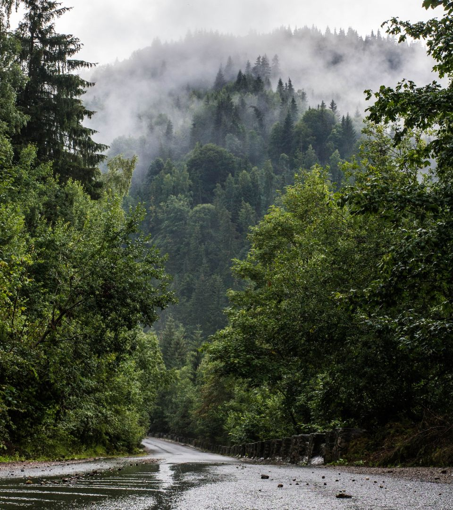

<section class="banner style1 orient-right fullscreen">

# Surface Runoff
## Methods in Spatial Analysis
## Assignment #5

Luke McQuade, January 2022

</section>

<section class="banner style1 orient-left content-align-left image-position-center onscroll-content-fade-in onscroll-image-fade-in fullscreen">

## The Map
## The Map
## The Map
## The Map
## The Map
## The Map
## The Map
## The Map
## The Map
## The Map
## The Map
## The Map
## The Map
## The Map
## The Map
## The Map
## The Map
## The Map
## The Map
## The Map
## The Map
## The Map
## The Map
## The Map
## The Map
## The Map
## The Map
## The Map
## The Map
## The Map
## The Map
## The Map
## The Map
## The Map
## The Map
## The Map
## The Map
## The Map
## The Map
## The Map
## The Map
## The Map
## The Map

    <iframe src="map/index.html"></iframe>

</section>

*Luke McQuade, January 2022*

Following a previous [assignment][Terrain], here we do some simple hydrological analysis of the area around the river Felber, in the mountainous Mittersill area of Salzburg.

TODO: Map - study area illustration.

As per the [exercise][Ex], a basic unit hydrograph can be created using the upslope distance from the point at which the Felber joins the Salzach (the pour-point, or outflow). There are several steps required to achieve this. Starting with a digital elevation model (DEM) of the area, 
* Fill sinks
* Generate flow accumulation surface
* Generate upslope distance from pour point surface

There doesn't seem to be a tool in QGIS explictly designed for this, but it can be achieved with an unconventional use of the *Overland flow distance to channel network* operation. This expects a channel network raster layer to be fed into it. Instead, create a single pixel raster of the pour point, and use that in its place.

TODO: Map 
* DEM

[Terrain]: TODO
[Ex]: TODO