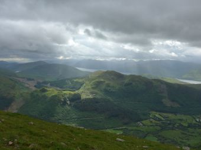
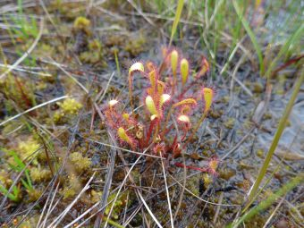
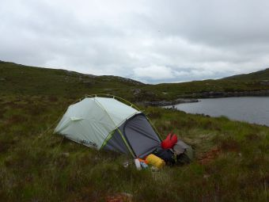
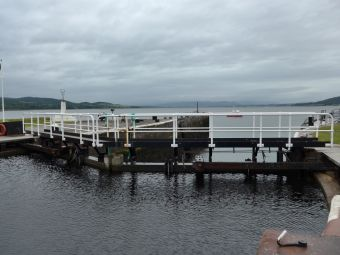
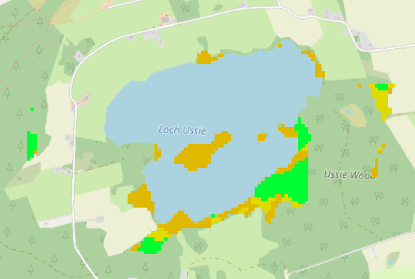

<!-- Header -->
<section class="align-center">
<header markdown="1">


# Highland Hammockery
  
Finding suitable camping spots using weighted overlay analysis

</header>
<div class="content" markdown="1">

Luke McQuade, January 2022

📷 *Flag: "Scotland Grunge Flag" by Free Grunge Textures - www.freestock.ca, CC BY 2.0.*  
*Banner and others: L. McQuade.*

</div>
</section>

<!-- Introduction -->
<section class="wrapper style1 center">
<div class="inner" markdown="1" style="padding-bottom: 0px">

## Introduction
Scotland, unlike the rest of the United Kingdom, offers the right to roam and wild camp across the country's open land (with a few [restrictions][R2R])). This makes it a good place for ad-hoc outdoor adventures.  

But, due to the rugged terrain and uneven ground, especially in the more rural areas, finding suitable camping spots is not always easy. Scotland does however, have the largest forest cover in the UK ([~18%, as of 2019][ForStrat]). Without detailed local knowledge, this makes the hammock the ideal choice for camping.

That said, not all woodland is suitable for hanging a hammock:
* Trees need to be a minimum of 15cm across to avoid damage, so younger woodland is to be avoided.
* A clear 3.5-5m between trees is needed. Coniferous plantations have the highest chance of guaranteeing this. Other forest types may have obstructing undergrowth, or may be too dense.
* A golden rule of hammocking is: Always look up before starting. Unhealthy or old, large-boughed trees and high winds are a dangerous combination.
* Active forestry operations are best avoided.
* Fire risk is also something to consider.

*See also, [Grand Trunk's guide to hammock safety][GTSafety].*

A region around the small, coastal city of Inverness in the Highlands is the focus of this investigation. The area features rolling hills, and encompasses part of the famous Loch Ness and the Caledonian canal as it meets the North Sea. Weighted overlay analysis is performed using the built-in tools of QGIS.  

</div>

<div class="inner" style="padding-top: 0px; padding-bottom: 0px;">
<div class="items style1 medium center">
<section markdown="1">


*Ascending Ben Nevis*

 Typical Highland scenery.

</section>
<section>
<div class="inner" markdown="1">


*Summit of Ben Nevis*

Surfaces that are unaccommodating for tents can appear flat on all but the highest-resolution elevation models.

</div>
</section>
<section>
<div class="inner" markdown="1">


*Sundew*

Likewise, wet ground can be problematic for tents.


</div>
</section>
<section>
<div class="inner" markdown="1">


*Outside Drumnadrochit*

Even so, there's still usually a place to pitch a tent by the end of the day.  

</div>
</section>
<section>
<div class="inner" markdown="1">


*Scots pine, Beinn Eighe*

Ancient [Caledonian forest][CalFor] can be a tempting destination, but extra care has to be taken in this delicate environment.

</div>
</section>
<section>
<div class="inner" markdown="1">


*Tatty scones*  

Access to fresh supplies is always something to think about.  

</div>
</section>
<section>
<div class="inner" markdown="1">


*Highland cattle*  

Dangers from wildlife are minimal, [for now][Rewilding]. (Though still be [careful around cows][Cows].) 

</div>
</section>
<section>
<div class="inner" markdown="1">


*The Inverness Sea Lock*

The coastline of Scotland can be complex, so its not always obvious if water on the map is salt- or fresh-water in reality.  

</div>
</section>


</div>
</div>
</section>

<!-- Method -->
<section class="wrapper style1">
<div class="inner" markdown="1">

## Method

Given some of the factors discussed earlier, a model for suitable hammock-camping spots can be created. There are some hard requirements that have to be fulfilled, and then preference or desirability can be considered. A final suitability rating of 1 to 5 is assigned.

An approach similar to *[@spatialthoughts][ST]*' *[Multi Criteria Overlay Analysis guide][MCOAGuide]* was taken, mainly using the *Raster Calculator* and *Proximity (raster distance)* tools.

### Model

#### Essential

| Criterion | Rationale
| --- | --- |
| In woodland | It's difficult to hang a hammock otherwise. 
| At least 100m from built-up area | For discretion, and less likely to encroach on enclosed land.
| At most 500m from water | For cooking and cleaning.
| Within 100m of an accessible trail | Trekking through woodland can be difficult.
| Not less than 10m from trail | For discretion, and to account for width of track.  

#### Desirability

| Criterion | Weighting | Rationale
| --- | --- |
| Forest type: Deciduous Broadleaf | 1 | Most likely to have obstructing undergrowth.
| Forest type: Coniferous | 4 | Most likely to have clear distance between trees.
| Forest type: Mixed | 2 | Has characteristics of each of the above.
| Within 5km of a supermarket | 0.5 | Access to supplies, approx. 1hr one-way.
| Within 2.5km of a pub | 0.5 | Access to beer, approx. 1hr round-trip.

#### Not considered

| Criterion | Rationale
| --- | --- |
| Terrain | Most walkable slopes are suitable for a hammock. The region of interest (RoI) doesn't have many unwalkable slopes. 


### Data

#### Trails
The UK has a leading national map provider, [Ordnance Survey][OS]. While there are many datasets offered under an open license, unfortunately the public footpath/hiking trail network is not available. [OpenStreetMap][OSM] (OSM) however, is popular enough in the area that it should be reliable enough for our needs.

The following [Overpass Turbo][OT] query fragment was used to find the walking-accessible (non-private) tracks, from minor roads to footpaths/trails.  

```
type:way AND highway!=motorway AND highway !=trunk AND highway!=primary AND highway!=motorway_link AND highway!=trunk_link AND highway!=primary_link
AND access!=customers AND access!=private AND access!=no
```

#### Pubs and supermarkets
OSM was also queried to find the pubs (`amentity=pub`) and supermarkets (`shop=supermarket`) in the area.


#### Forest/land cover
Again, OSM was consulted for forested areas. However, the woodland type was not always present in the data, and an alternative source had to be found.  

Fortunately in 2021, Space Intelligence with NatureScot released a [land cover dataset][SILandCov] with 20m spatial resolution, discriminating coniferous, deciduous broadleaf, and mixed forest. This also features built-up and inland water, which are useful for the other criteria in our analysis.

*A fully comprehensive source of forestry data was discovered later in the investigation - the Forestry Commission's [National Forest Inventory][ForInv].*  

</div>
</section>

<section class="banner fullscreen style1">
<div class="content" markdown="1">

## Results
After performing the overlay analysis, a map showing suitable regions was created. Overlay layers for each of the criteria can be toggled to view the effects each has on the end result. (CSS blend modes were employed for this - see [custom.css][BCSS].)  

### Limitations
There are some shortcomings with the model, and in practice it's probably not very useful without further work. 
* It's not just people's gardens that are out of bounds, plenty of private/protected forest is enclosed and inaccessible.
* Forest type alone is not an accurate deciding factor - plenty of broadleaf woodland is suitably sparse, and coniferous unsuitably dense. Effectively, forest type was a proxy for tree density, which may be possible to determine more directly. See, e.g. [*Mapping tree density at a global scale (Crowther et al, Nature)*][TD].   
* Features outside of the region of interest weren't taken into account, so assesments for distance-based criteria towards the boundary may be inaccurate.  
* In remote areas, land designated as built-up may not be inhabited, e.g. bothys, leading to those surroundings being unnecessarily deemed unsuitable.
* The on-foot accessibility of terrain wasn't really taken into account, e.g. distance calculations were simple straight-line calculations.


📷 *This island in the middle of a loch was inappropriately deemed a suitable camping spot - it would be difficult to reach without a boat.*

Some of these could be tackled in follow-up work using cost distance analysis.

</div>
<div class="image lm-sticky">
    <iframe src="map/index.html"></iframe>
</div>
</section>

<section class="wrapper style1">
<div class="inner" markdown="1">

## Tips
### No Data
*NoData* can be troublesome when combining layers. It is coercive. For instance, a landcover layer may have NoData defined for sea areas within its extent. Have a raster layer for docked ships  in that area that you want to combine it with? In the raster calculator, these rules apply: 
* `0 * 0 = 0`
* `{anything} * NoData = NoData`
* `{anything} + NoData = NoData`

So, you'd probably end up with an empty result.

Also, take care when rasterizing vectors - unset the 'Assign a specified nodata value' option to give empty areas a value of 0, so it can be used as an overlay.
Another rule: `0 / 0 = NoData`. This is useful to know when wanting to filter out 0 values, e.g. ([source][SOND])  
```
"layer@1" / ("layer@1" > 0)"
```

[r.null][RN] can be used to go the other way, assigning 0 in place of NoData.

### Source

Go to [page source][Src].

</div>
</section>


[R2R]: https://www.heraldscotland.com/news/19459239.right-roam-work-scotland-differ-england/
[ForStrat]: https://www.gov.scot/publications/scotlands-forestry-strategy-20192029/pages/4/
[GTSafety]: https://www.grandtrunk.com/blogs/news/hammock-safety-where-to-hang
[CalFor]: https://www.wildlifetrusts.org/habitats/woodland/caledonian-forest
[Rewilding]: https://www.theguardian.com/environment/2021/sep/24/reintroducing-wolves-to-uk-could-hit-rewilding-support-expert-says
[Cows]: https://scottishwildlifetrust.org.uk/2014/08/great-british-dangers/
[OS]: https://ordnancesurvey.co.uk/
[OSM]: https://www.openstreetmap.org/
[OT]: https://overpass-turbo.eu/
[ForInv]: https://data-forestry.opendata.arcgis.com/search?tags=Scotland
[SILandCov]: https://www.space-intelligence.com/2021/04/01/weve-just-published-the-first-ever-scotland-wide-high-resolution-habitat-maps-for-free/
[ST]: https://twitter.com/spatialthoughts
[MCOAGuide]: https://www.qgistutorials.com/en/docs/3/multi_criteria_overlay.html
[BCSS]: TODO
[SOND]: https://gis.stackexchange.com/a/316249/197764
[RN]: https://grass.osgeo.org/grass80/manuals/r.null.html
[TD]: https://www.nature.com/articles/nature14967
[Src]: TODO